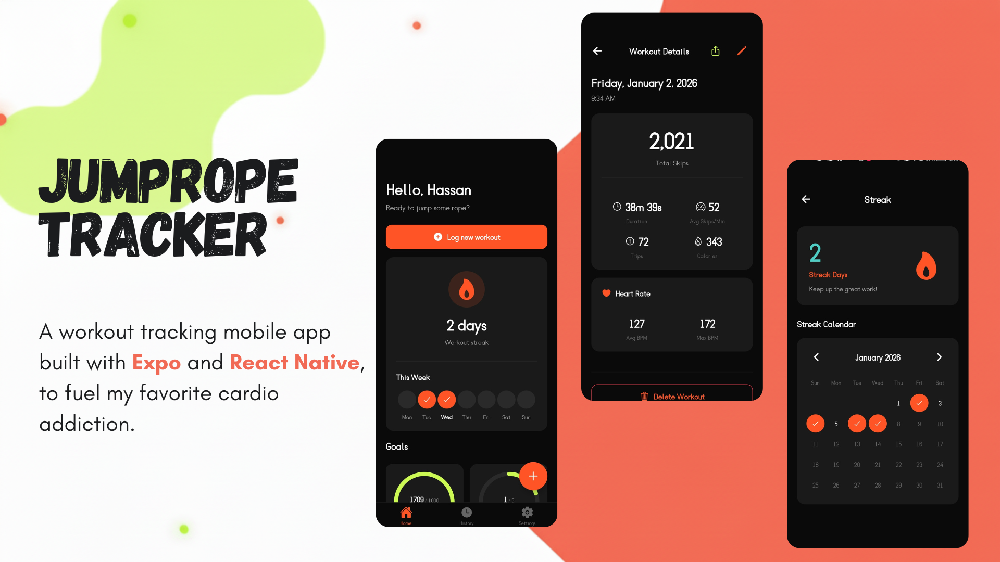
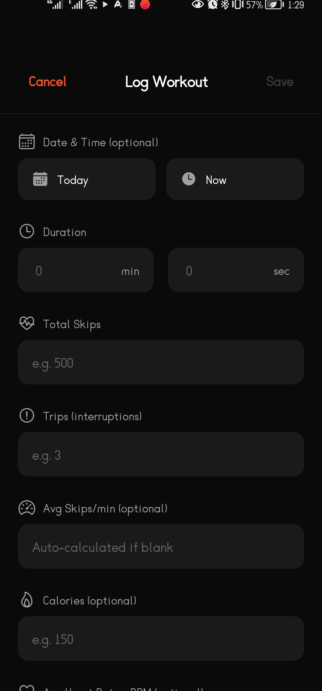
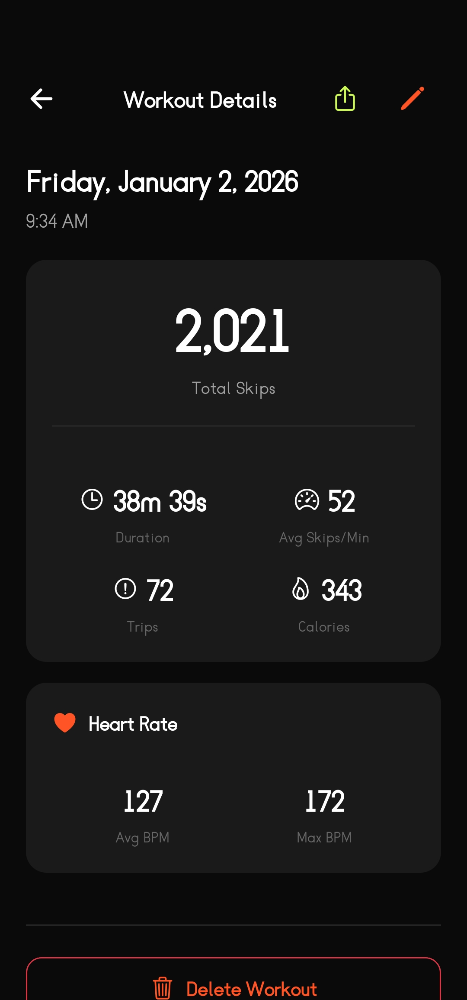
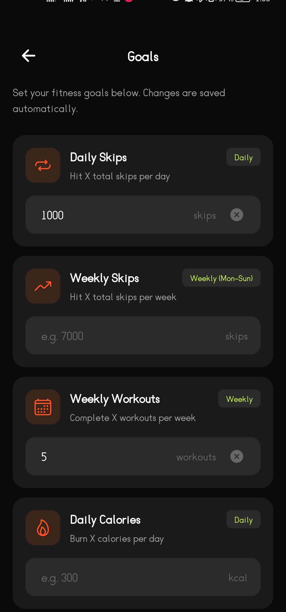
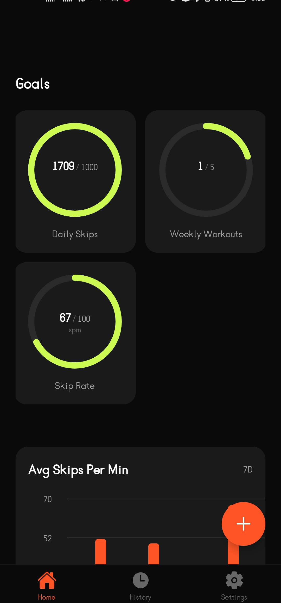
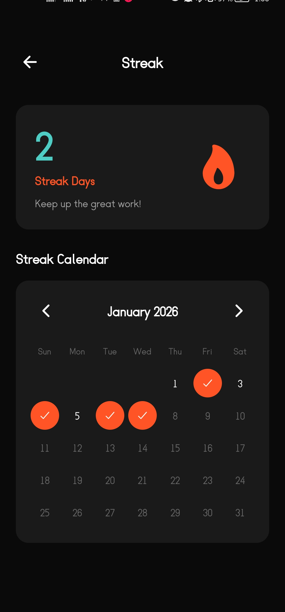
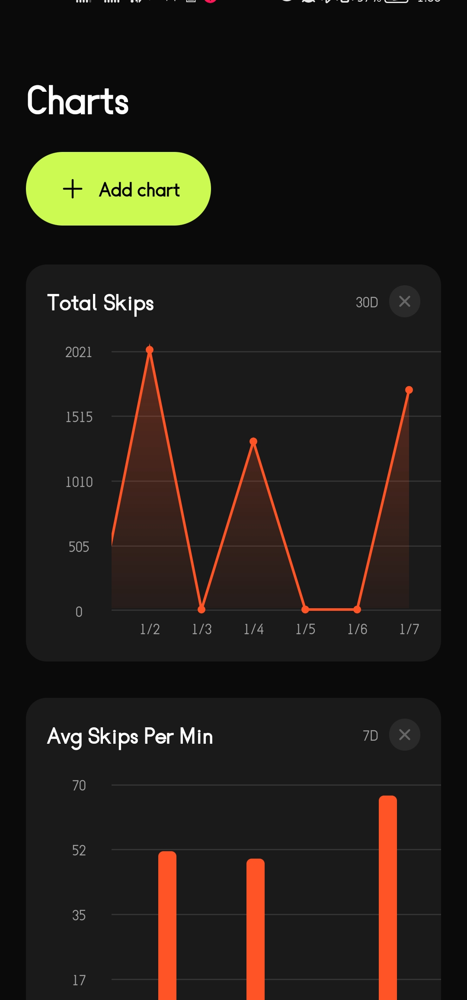
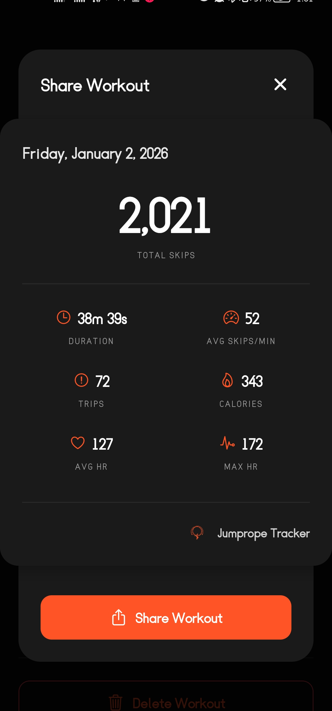
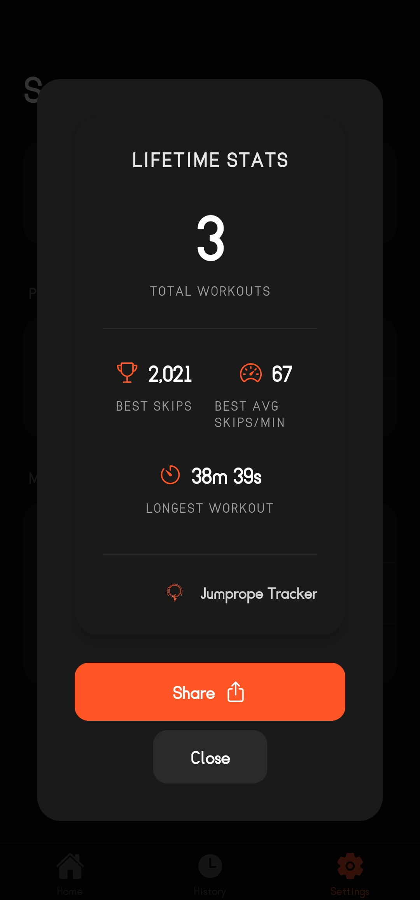
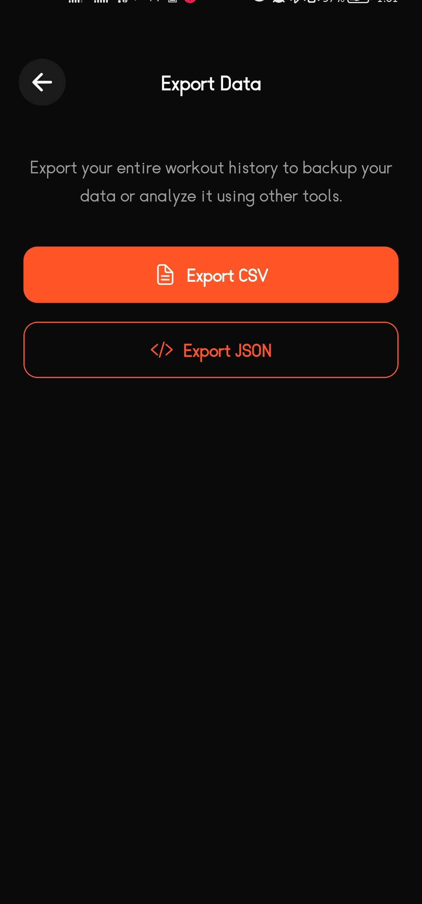

# Jumprope Tracker

A minimal, offline-first mobile app for tracking your jump rope workouts. Log your sessions, visualize your progress, maintain workout streaks, and crush your fitness goals.

## Overview

A couple months ago, I started using a jumprope to improve my cardio and lose some weight. It's the most fun cardio I've ever done. But being the geek that I am, I also wanted to track my progress and see how I was doing. So I built this app.

I designed this app with a couple simple rules in mind:

-   **Offline-first**: All your data stays on your device. No accounts, no cloud sync, no subscriptions.
-   **Minimal & focused**: One thing, done exceptionally well.
-   **Delightful UX**: Because if the UX isn't satisfying, I know I won't use it consistently.

   

## Features

### Workout Logging

Track everything about your jump rope sessions:

-   **Duration**: How long you jumped
-   **Total Skips**: Your full skip count
-   **Avg Skips/Min**: Automatically calculated from your duration and skips
-   **Trips**: Track interruptions or misses
-   **Calories**: Estimated calories burned (optional)
-   **Heart Rate**: Average and max BPM (optional)
-   **Notes**: Add context to your workouts

I should note that logging workout data is manual right now. It works for me. But it would be trivial to add a CSV or JSON import feature as well.

  
   

### Goal Tracking

Set personal targets and stay motivated:

-   **Daily or Weekly Goals**: Choose what works for your routine
-   **Multiple Goals**: Track skips, calories, duration, or workout count simultaneously
-   **Progress Visualization**: See how close you are to hitting your targets
-   **Automatic Resets**: Daily goals reset at midnight, weekly goals reset on Monday

  
   

### Streak Tracking

Build consistency with workout streaks:

-   **Consecutive Day Tracking**: See how many days in a row you've worked out
-   **Rest Days**: Mark planned recovery days to preserve your streak
-   **Streak Counter**: A visual reminder of your dedication on the home screen

### Charts & Stats

Visualize your performance over time:

-   **Multiple Chart Types**: Bar, line, and area charts
-   **Flexible Time Ranges**: View the last 7 days, 30 days, or 90 days
-   **Key Metrics**: Track skips, calories, duration, skip rate, and more
-   **Lifetime Stats**: See your total workouts, highest skips, longest duration, and best skip rate

### Workout Sharing

Share your progress with friends:

-   **Shareable Cards**: Generate beautiful workout summary cards
-   **Share Anywhere**: Post to Instagram, Twitter, WhatsApp, or any other app
-   **No Watermarks**: Clean, branded cards without intrusive branding
-   **Lifetime**: Share your lifetime stats with a beautiful card

  
   

### Data Export

I wanted to be able to export data cleanly so I can process it in other apps or whatever.

And besides, your data belongs to you:

-   **CSV & JSON Export**: Download all your workout data
-   **Easy Backup**: Save to Files, email to yourself, or upload to cloud storage

### Perma-Dark Mode

Easy on the eyes. I'm not a fan of light mode.

## Getting Started

~~1. Download Jumprope Tracker from the App Store or Google Play~~

1. Go to the Releases page and download the latest APK file, and install it on your phone.

    > [!NOTE]
    > I haven't published this app to the Play Store yet, so you'll need to install it manually. I'm gonna put it on the play store soon, so don't worry. :)

2. Add your profile information (optional, but recommended; like I said, all data is stored locally.)
3. Log your first workout and start building your streak!

## About the Author

I'm a freelance developer who builds web and mobile apps for people. This is a side project of mine, built only because of my new jumprope hobby.

-   [Twitter/X](https://x.com/nothassanaziz)
-   [YouTube](https://youtube.com/@itshassanaziz)
-   [GitHub](https://github.com/hassanaziz0012)
-   [Website](https://www.hassandev.me)
